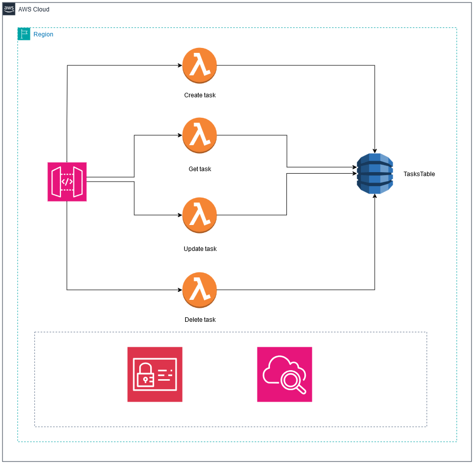
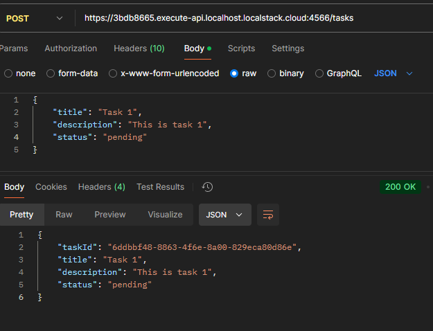
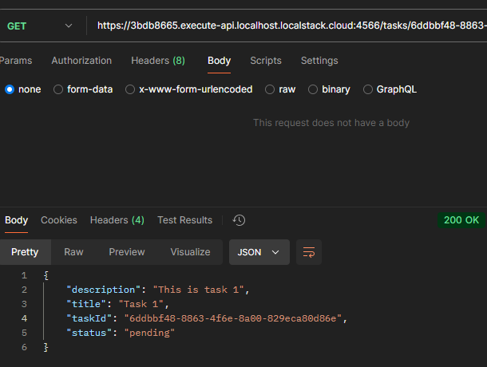
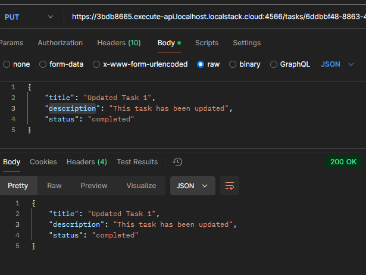
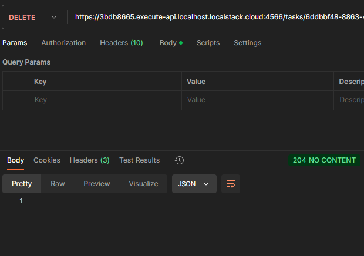

# AWS - Serverless CRUD Task



This README will provide an overview of the system architecture. It will breifly describe each component.

- [Components](#components)
  - [API Gateway](#api-gateway)
  - [Lambda functions](#lambda-functions)
  - [Dynamo DB Table](#dynamo-db-table)
- [Setup](#setup)
- [Usage](#usage)
- [Testing](#testing)

## Components

### API Gateway

Amazon API Gateway is used to create the API that the clients interacts with. It serves as the entry point for the application.

### Lambda Functions

We have four lambda functions, one for each CRUD operations, create task, get task, update task, and delete task. The API gateway resource have a permission to invoke them, as well as each function having the required permissions that it needs to interact with the dynamodb table using IAM roles and policies.

### Dynamo DB Table

This is where the tasks will be stored, currently it uses 'on-demand' capacity mode, later if we found that our requests are predictable we can change it to the provisioned capacity mode, as it will be more cost-effective.

## Setup

AWS CDK used to provision the components of the system, in order to re-produce the setup, make sure you have python and the cdk cli installed and follow those instructions

### clone the repo

```bash
git clone https://github.com/mohamedhafizelhaj/AWS-Serverless-CRUD-Task
```

### create an isolated virual environment

```bash
python3 -m venv .venv
source .venv/bin/activate
```

### install the requirements

```bash
pip install -r requirements.txt
```

### synthesize your cdk template

```bash
cdk synzth
```

### bootstrap the environment in your account

```bash
cdk bootstrap aws://{account_id}/{region}
```

### deploy the stack

```bash
cdk deploy
```

## Usage

### Create a task



### Get a task



### Update a task



### Delete a task



## Testing

Note that currently I am hardcoding the logical resource names in the infrastructure test file for simplicity, if you would like to run the tests, you should replace them with your resource names found in the synthesized cloudformation template, after that run

```bash
pytest tests/unit
```